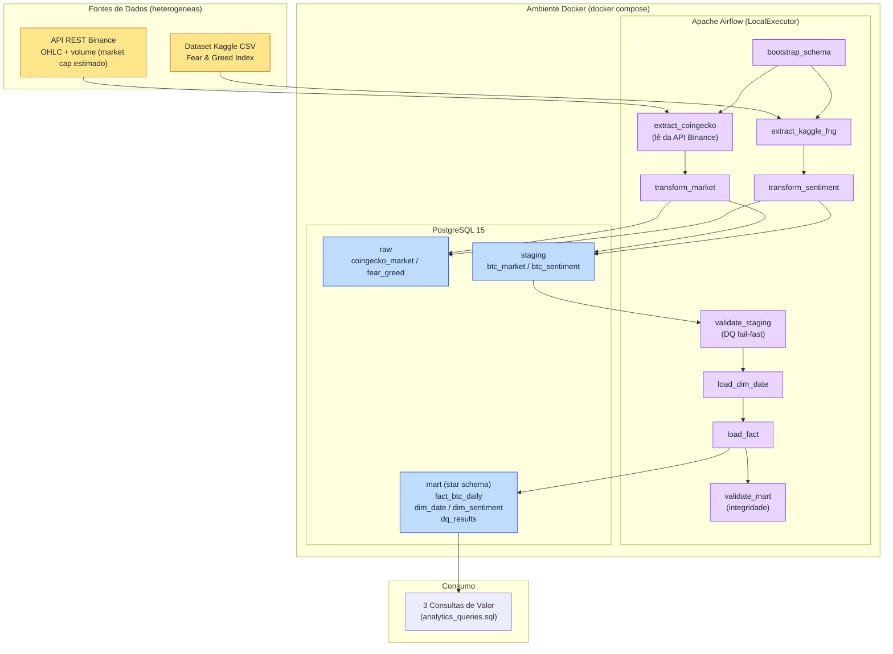
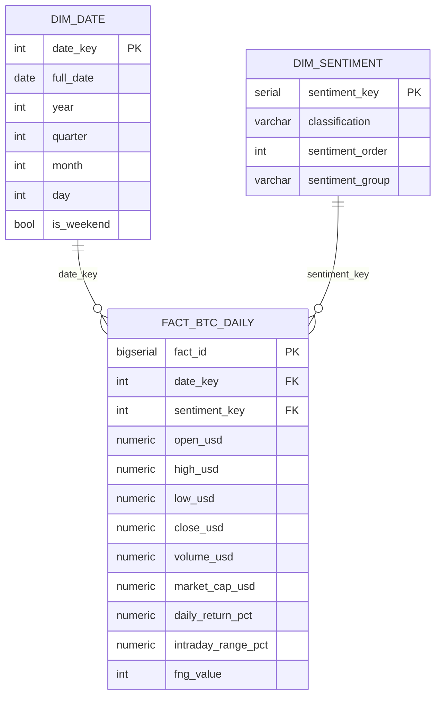

# Diagrama de Arquitetura — ETL Bitcoin

Diagrama do pipeline end-to-end (renderiza no GitHub).

```mermaid
flowchart TB
    subgraph SRC["Fontes de Dados (heterogeneas)"]
        CG["API REST Binance<br/>OHLC + volume (market cap estimado)"]
        KG["Dataset Kaggle CSV<br/>Fear &amp; Greed Index"]
    end

    subgraph DOCKER["Ambiente Docker (docker compose)"]
        subgraph AF["Apache Airflow (LocalExecutor)"]
            direction TB
            T0["bootstrap_schema"]
            T1["extract_coingecko<br/>(lê da API Binance)"]
            T2["extract_kaggle_fng"]
            T3["transform_market"]
            T4["transform_sentiment"]
            T5["validate_staging<br/>(DQ fail-fast)"]
            T6["load_dim_date"]
            T7["load_fact"]
            T8["validate_mart<br/>(integridade)"]
        end

        subgraph PG["PostgreSQL 15"]
            direction TB
            RAW["raw<br/>coingecko_market / fear_greed"]
            STG["staging<br/>btc_market / btc_sentiment"]
            MART["mart (star schema)<br/>fact_btc_daily<br/>dim_date / dim_sentiment<br/>dq_results"]
        end
    end

    subgraph OUT["Consumo"]
        Q["3 Consultas de Valor<br/>(analytics_queries.sql)"]
    end

    CG --> T1
    KG --> T2
    T0 --> T1 & T2
    T1 --> T3 --> RAW
    T2 --> T4 --> RAW
    T3 --> STG
    T4 --> STG
    STG --> T5 --> T6 --> T7 --> T8
    T7 --> MART
    MART --> Q

    classDef src fill:#fde68a,stroke:#b45309,color:#1f2937;
    classDef db fill:#bfdbfe,stroke:#1d4ed8,color:#1f2937;
    classDef task fill:#e9d5ff,stroke:#7c3aed,color:#1f2937;
    class CG,KG src;
    class RAW,STG,MART db;
    class T0,T1,T2,T3,T4,T5,T6,T7,T8 task;
```

## Modelo Dimensional (Star Schema)

```mermaid
erDiagram
    DIM_DATE ||--o{ FACT_BTC_DAILY : "date_key"
    DIM_SENTIMENT ||--o{ FACT_BTC_DAILY : "sentiment_key"

    FACT_BTC_DAILY {
        bigserial fact_id PK
        int date_key FK
        int sentiment_key FK
        numeric open_usd
        numeric high_usd
        numeric low_usd
        numeric close_usd
        numeric volume_usd
        numeric market_cap_usd
        numeric daily_return_pct
        numeric intraday_range_pct
        int fng_value
    }
    DIM_DATE {
        int date_key PK
        date full_date
        int year
        int quarter
        int month
        int day
        bool is_weekend
    }
    DIM_SENTIMENT {
        serial sentiment_key PK
        varchar classification
        int sentiment_order
        varchar sentiment_group
    }
```
